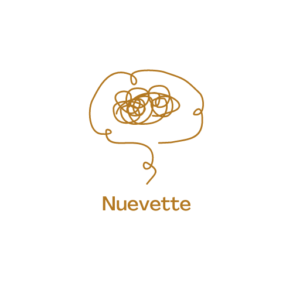
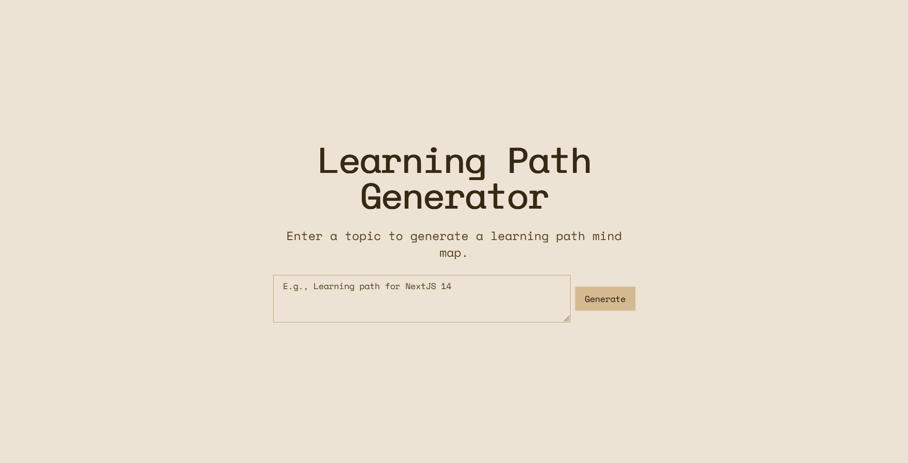
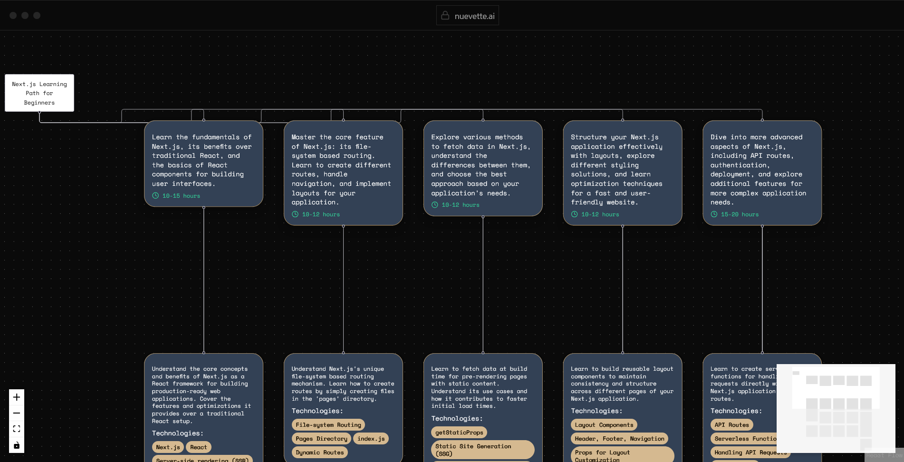

<a name="readme-top"></a>

<!-- PROJECT SHIELDS -->
[![Contributors][contributors-shield]][contributors-url]
[![Forks][forks-shield]][forks-url]
[![Stargazers][stars-shield]][stars-url]
[![Issues][issues-shield]][issues-url]
[![MIT License][license-shield]][license-url]


<br />
<div align="center">
  <a href="https://github.com/Sudhanshu-Bharti/nuevette">
    
  </a>

  <h3 align="center">Nuevette.ai</h3>

  <p align="center">
    A web application that generates customized learning paths on any topic!
    <br />
    <a href="https://github.com/Sudhanshu-Bharti/nuevette"><strong>Explore the docs »</strong></a>
    <br />
    <br />
    <a href="https://github.com/Sudhanshu-Bharti/nuevette">View Demo</a>
    ·
    <a href="https://github.com/Sudhanshu-Bharti/nuevette/issues">Report Bug</a>
    ·
    <a href="https://github.com/Sudhanshu-Bharti/nuevette/issues">Request Feature</a>
  </p>
</div>

<!-- TABLE OF CONTENTS -->
<details>
  <summary>Table of Contents</summary>
  <ol>
    <li>
      <a href="#about-the-project">About The Project</a>
      <ul>
        <li><a href="#built-with">Built With</a></li>
      </ul>
    </li>
    <li>
      <a href="#getting-started">Getting Started</a>
      <ul>
        <li><a href="#prerequisites">Prerequisites</a></li>
        <li><a href="#installation">Installation</a></li>
      </ul>
    </li>
    <li><a href="#usage">Usage</a></li>
    <li><a href="#roadmap">Roadmap</a></li>
    <li><a href="#contributing">Contributing</a></li>
    <li><a href="#license">License</a></li>
    <li><a href="#contact">Contact</a></li>
    <li><a href="#acknowledgments">Acknowledgments</a></li>
  </ol>
</details>

<!-- ABOUT THE PROJECT -->
## About The Project




Nuevette is a web application that generates customized learning paths on any topic. By simply entering a topic, users receive a detailed learning path visualized, ready for exploration. It's perfect for anyone looking to streamline their learning journey with a visually structured approach.

<p align="right">(<a href="#readme-top">back to top</a>)</p>

### Built With

* [![Next][Next.js]][Next-url]
* [![React][React.js]][React-url]
* [![TypeScript][TypeScript]][TypeScript-url]
* [![Tailwind][TailwindCSS]][Tailwind-url]

<p align="right">(<a href="#readme-top">back to top</a>)</p>

<!-- GETTING STARTED -->
## Getting Started

To get a local copy up and running follow these simple steps.

### Prerequisites

* Node.js (v14 or later)
* npm (v6 or later)
  ```sh
  npm install npm@latest -g
  ```

### Installation

1. Clone the repository
   ```sh
   git clone https://github.com/Sudhanshu-Bharti/nuevette.git
   ```
2. Navigate to the project directory
   ```sh
   cd nuevette
   ```
3. Install NPM packages
   ```sh
   npm install
   ```
4. Create a `.env` file in the root directory and add your API keys:
   ```plaintext
   NEXT_PUBLIC_GOOGLE_API_KEY="YOUR_GOOGLE_API_KEY"
   NEXT_PUBLIC_SERP_API_KEY="YOUR_SERP_API_KEY"
   ```

<p align="right">(<a href="#readme-top">back to top</a>)</p>

<!-- USAGE EXAMPLES -->
## Usage

1. Start the development server:
   ```sh
   npm run start
   ```
2. Open your browser and visit `http://localhost:3000`
3. Enter a topic in the input field
4. Click "Generate Learning Path"
5. Explore your personalized learning path!

<p align="right">(<a href="#readme-top">back to top</a>)</p>

<!-- ROADMAP -->
## Roadmap

- [ ] Add more customization options for learning paths
- [ ] Implement user accounts and saved learning paths
- [ ] Integrate with additional learning resources and platforms
- [ ] Add multi-language support

See the [open issues](https://github.com/Sudhanshu-Bharti/nuevette/issues) for a full list of proposed features (and known issues).

<p align="right">(<a href="#readme-top">back to top</a>)</p>

<!-- CONTRIBUTING -->
## Contributing

Contributions are what make the open source community such an amazing place to learn, inspire, and create. Any contributions you make are **greatly appreciated**.

If you have a suggestion that would make this better, please fork the repo and create a pull request. You can also simply open an issue with the tag "enhancement".
Don't forget to give the project a star! Thanks again!

1. Fork the Project
2. Create your Feature Branch (`git checkout -b feature/AmazingFeature`)
3. Commit your Changes (`git commit -m 'Add some AmazingFeature'`)
4. Push to the Branch (`git push origin feature/AmazingFeature`)
5. Open a Pull Request

<p align="right">(<a href="#readme-top">back to top</a>)</p>

<!-- LICENSE -->
## License

Distributed under the MIT License. See `LICENSE.txt` for more information.

<p align="right">(<a href="#readme-top">back to top</a>)</p>

<!-- CONTACT -->
## Contact

Sudhanshu Bharti - [@its_me_shubbb](https://twitter.com/its_me_shubbb) - itsmeshubbb@gmail.com

Project Link: [https://github.com/Sudhanshu-Bharti/nuevette](https://github.com/Sudhanshu-Bharti/nuevette)

<p align="right">(<a href="#readme-top">back to top</a>)</p>

<!-- ACKNOWLEDGMENTS -->
## Acknowledgments

* [Gemini API](https://deepmind.google/technologies/gemini/)
* [SERP API](https://serpapi.com/)
* [Img Shields](https://shields.io)
* [GitHub Pages](https://pages.github.com)

<p align="right">(<a href="#readme-top">back to top</a>)</p>

<!-- MARKDOWN LINKS & IMAGES -->
<!-- https://www.markdownguide.org/basic-syntax/#reference-style-links -->
[contributors-shield]: https://img.shields.io/github/contributors/Sudhanshu-Bharti/nuevette.svg?style=for-the-badge
[contributors-url]: https://github.com/Sudhanshu-Bharti/nuevette/graphs/contributors
[forks-shield]: https://img.shields.io/github/forks/Sudhanshu-Bharti/nuevette.svg?style=for-the-badge
[forks-url]: https://github.com/Sudhanshu-Bharti/nuevette/network/members
[stars-shield]: https://img.shields.io/github/stars/Sudhanshu-Bharti/nuevette.svg?style=for-the-badge
[stars-url]: https://github.com/Sudhanshu-Bharti/nuevette/stargazers
[issues-shield]: https://img.shields.io/github/issues/Sudhanshu-Bharti/nuevette.svg?style=for-the-badge
[issues-url]: https://github.com/Sudhanshu-Bharti/nuevette/issues
[license-shield]: https://img.shields.io/github/license/Sudhanshu-Bharti/nuevette.svg?style=for-the-badge
[license-url]: https://github.com/Sudhanshu-Bharti/nuevette/blob/master/LICENSE.txt
[product-screenshot]: images/screenshot.png
[Next.js]: https://img.shields.io/badge/next.js-000000?style=for-the-badge&logo=nextdotjs&logoColor=white
[Next-url]: https://nextjs.org/
[React.js]: https://img.shields.io/badge/React-20232A?style=for-the-badge&logo=react&logoColor=61DAFB
[React-url]: https://reactjs.org/
[TypeScript]: https://img.shields.io/badge/TypeScript-007ACC?style=for-the-badge&logo=typescript&logoColor=white
[TypeScript-url]: https://www.typescriptlang.org/
[TailwindCSS]: https://img.shields.io/badge/Tailwind_CSS-38B2AC?style=for-the-badge&logo=tailwind-css&logoColor=white
[Tailwind-url]: https://tailwindcss.com/